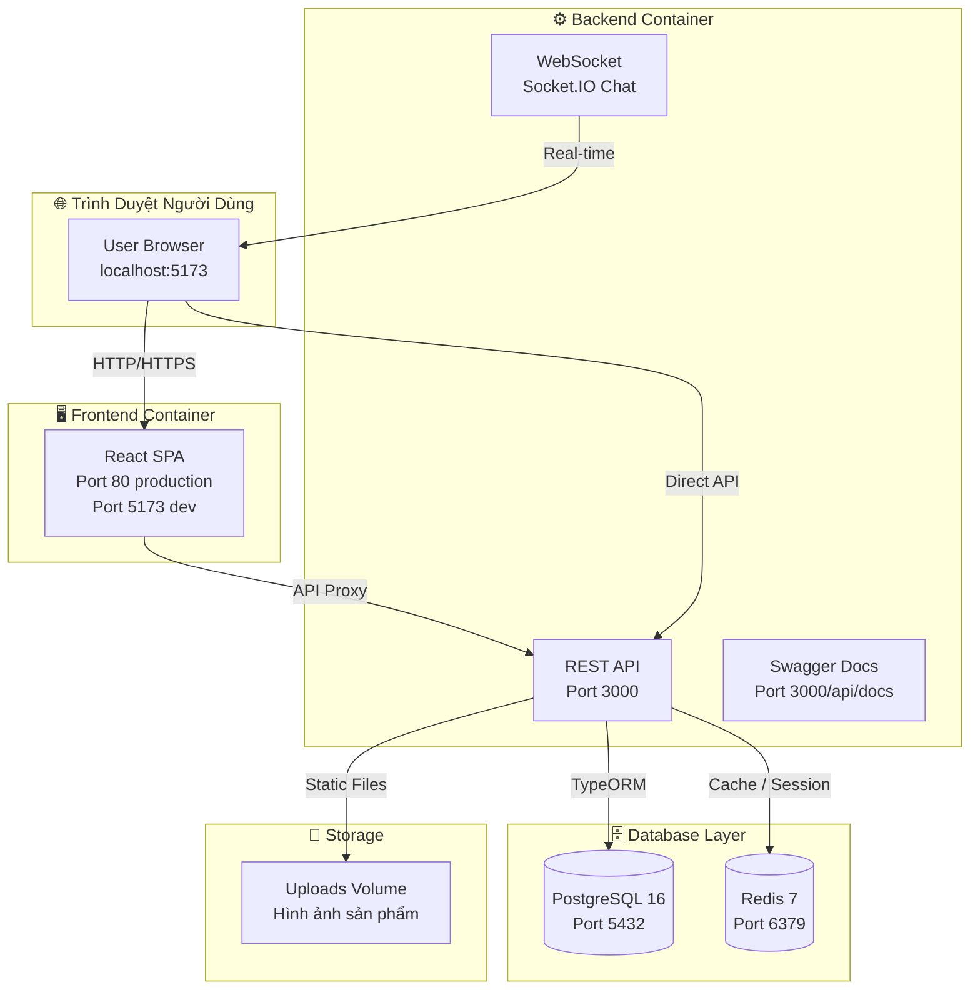
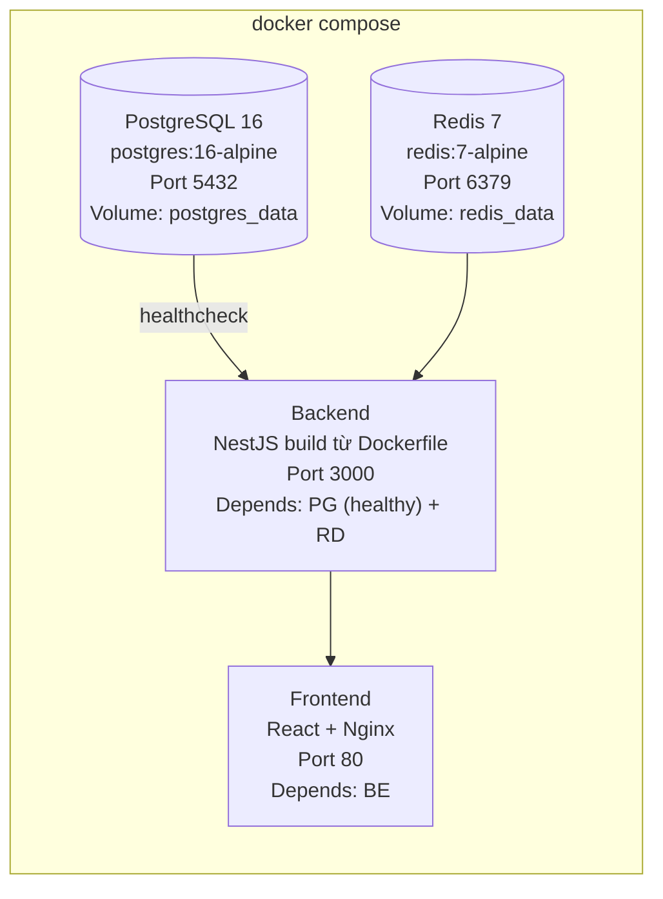
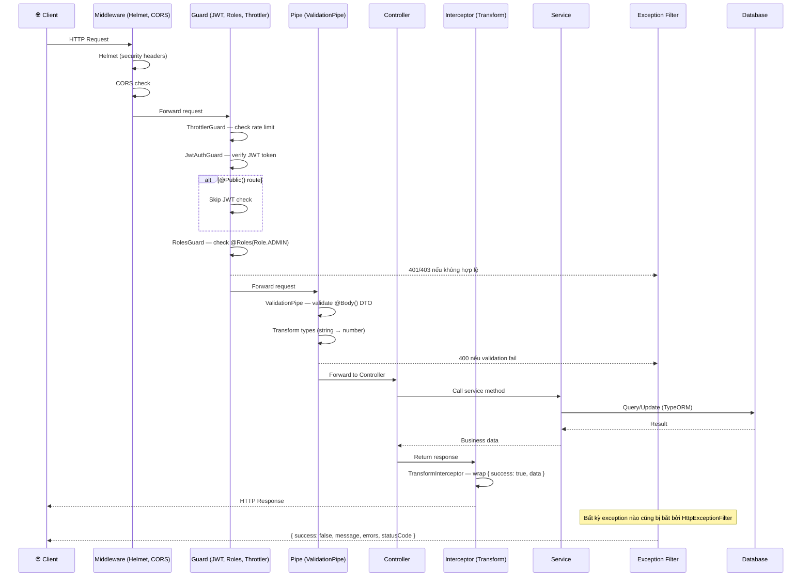
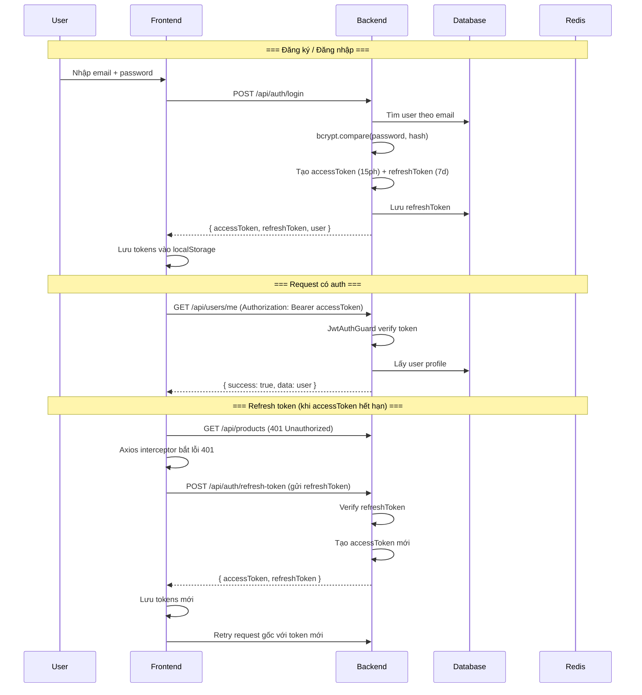
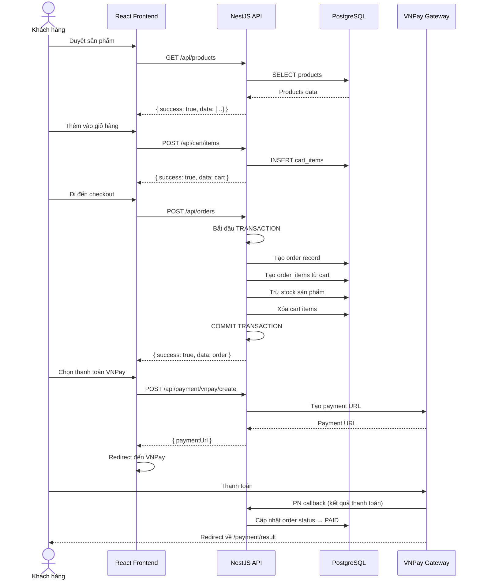
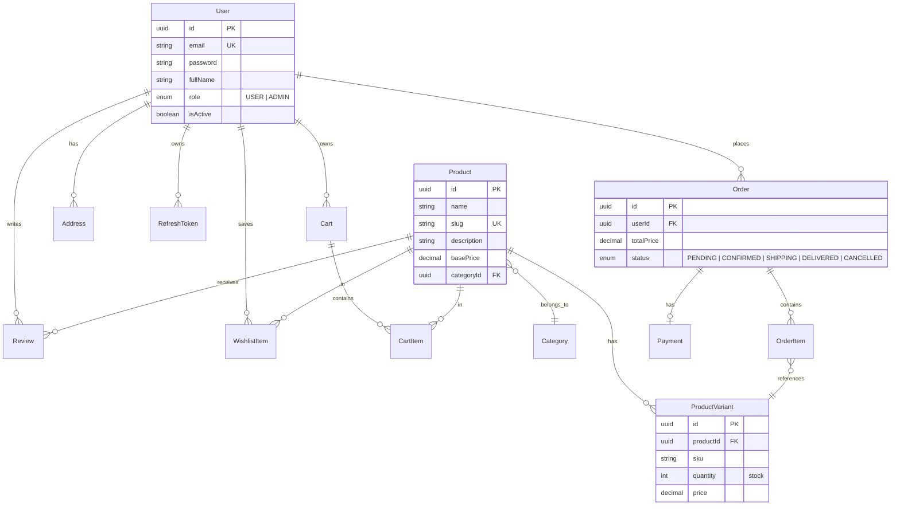

# 🛒 E-Commerce — Phân Tích Kiến Trúc Chi Tiết cho Newbie

> **Mục tiêu**: Giúp người mới hiểu toàn bộ kiến trúc, công nghệ, cách tổ chức code, và luồng hoạt động của dự án.  
> **Repo**: [github.com/duminoi/E-Commerce](https://github.com/duminoi/E-Commerce)  
> **Ngày cập nhật**: 12/06/2026

---

## 📋 Mục Lục

1. [Tổng Quan Dự Án](#1-tổng-quan-dự-án)
2. [Công Nghệ Sử Dụng (Tech Stack)](#2-công-nghệ-sử-dụng-tech-stack)
3. [Cấu Trúc Thư Mục Toàn Dự Án](#3-cấu-trúc-thư-mục-toàn-dự-án)
4. [Hạ Tầng & DevOps (Docker)](#4-hạ-tầng--devops-docker)
5. [Backend — Kiến Trúc NestJS](#5-backend--kiến-trúc-nestjs)
6. [Frontend — Kiến Trúc React](#6-frontend--kiến-trúc-react)
7. [Luồng Dữ Liệu & Giao Tiếp BE-FE](#7-luồng-dữ-liệu--giao-tiếp-be-fe)
8. [Các Module & Chức Năng Chính](#8-các-module--chức-năng-chính)
9. [Design System & UI/UX](#9-design-system--uiux)
10. [Hướng Dẫn Code Cho Newbie](#10-hướng-dẫn-code-cho-newbie)

---

## 1. Tổng Quan Dự Án

Đây là một **nền tảng thương mại điện tử full-stack** được xây dựng với kiến trúc **monorepo** — toàn bộ backend và frontend nằm trong cùng một repository, quản lý bằng Docker Compose.

### Mô hình tổng thể



> [!NOTE]
> **Monorepo** nghĩa là `back-end/` và `front-end/` nằm chung trong một repo. Cả hai được chạy đồng thời bằng lệnh `npm run dev` từ thư mục gốc (dùng `concurrently`).

---

## 2. Công Nghệ Sử Dụng (Tech Stack)

### Backend

| Công nghệ | Phiên bản | Vai trò |
|---|---|---|
| **NestJS** | ^11.0.1 | Framework chính, kiến trúc module |
| **TypeScript** | ^5.7.3 | Ngôn ngữ lập trình |
| **TypeORM** | ^1.0.0 | ORM kết nối PostgreSQL |
| **PostgreSQL** | 16 (Alpine) | Cơ sở dữ liệu quan hệ |
| **Redis** | 7 (Alpine) | Cache, session, refresh token blacklist |
| **Passport + JWT** | passport-jwt ^4.0.1 | Xác thực người dùng |
| **Socket.IO** | ^4.8.3 | Chat real-time |
| **Swagger** | ^11.4.4 | Tự động sinh API documentation |
| **Winston** | ^3.19.0 | Logger (console + file) |
| **Nodemailer** | ^8.0.10 | Gửi email (xác nhận đơn hàng, reset password) |
| **Helmet** | ^8.2.0 | Bảo mật HTTP headers |
| **bcrypt** | ^6.0.0 | Mã hóa mật khẩu |
| **class-validator** | ^0.15.1 | Validate DTO đầu vào |

### Frontend

| Công nghệ | Phiên bản | Vai trò |
|---|---|---|
| **React** | ^19.2.6 | UI framework |
| **TypeScript** | ~6.0.2 | Ngôn ngữ lập trình |
| **Vite** | ^8.0.12 | Build tool (nhanh hơn Webpack) |
| **Tailwind CSS** | ^4.3.0 | Utility-first CSS framework |
| **React Router** | ^7.16.0 | Client-side routing |
| **Zustand** | ^5.0.14 | State management (nhẹ hơn Redux) |
| **Axios** | ^1.16.1 | HTTP client (có interceptor cho JWT) |
| **Socket.IO Client** | ^4.8.3 | WebSocket client cho chat |
| **react-hot-toast** | ^2.6.0 | Thông báo toast đẹp |

### DevOps

| Công nghệ | Vai trò |
|---|---|
| **Docker + Docker Compose** | Container hóa toàn bộ hệ thống |
| **Nginx** | Web server cho production (frontend) |
| **concurrently** | Chạy BE + FE đồng thời khi dev |

---

## 3. Cấu Trúc Thư Mục Toàn Dự Án

```
F:\Projects\E-Commerce\
│
├── 📄 package.json              # Root — scripts chạy BE+FE đồng thời
├── 📄 docker-compose.yml        # 4 services: postgres, redis, backend, frontend
├── 📄 .gitignore
│
├── 📁 back-end/                 # ⚙️ NestJS API Server
│   ├── 📄 package.json          # NestJS 11 dependencies
│   ├── 📄 .env                  # Biến môi trường (DB, JWT, Redis, VNPay, Mail)
│   ├── 📄 .env.example          # Template biến môi trường
│   ├── 📄 Dockerfile            # Multi-stage build cho production
│   ├── 📄 nest-cli.json         # NestJS CLI config
│   ├── 📄 tsconfig.json         # TypeScript config
│   ├── 📄 eslint.config.mjs     # Linter config
│   │
│   ├── 📁 src/
│   │   ├── 📄 main.ts           # 🔑 Entry point — bootstrap ứng dụng
│   │   ├── 📄 app.module.ts     # 🔑 Root Module — import tất cả module con
│   │   │
│   │   ├── 📁 config/           # ⚙️ Cấu hình tập trung
│   │   │   ├── app.config.ts        # Port, NodeEnv
│   │   │   ├── database.config.ts   # PostgreSQL connection
│   │   │   ├── jwt.config.ts        # JWT secret, expire time
│   │   │   └── redis.config.ts      # Redis connection
│   │   │
│   │   ├── 📁 common/           # 🧩 Thành phần dùng chung toàn app
│   │   │   ├── 📁 decorators/       # @Public(), @Roles(), @CurrentUser()
│   │   │   ├── 📁 enums/            # Role enum (USER, ADMIN)
│   │   │   ├── 📁 filters/          # HttpExceptionFilter — bắt lỗi toàn cục
│   │   │   ├── 📁 guards/           # JwtAuthGuard, RolesGuard
│   │   │   └── 📁 interceptors/     # TransformInterceptor — wrap response
│   │   │
│   │   ├── 📁 modules/          # 📦 14 Feature Modules
│   │   │   ├── 📁 auth/             # Đăng ký, đăng nhập, JWT, refresh token
│   │   │   ├── 📁 user/             # Quản lý người dùng, địa chỉ
│   │   │   ├── 📁 product/          # Sản phẩm, biến thể, tìm kiếm, lọc
│   │   │   ├── 📁 category/         # Danh mục sản phẩm
│   │   │   ├── 📁 cart/             # Giỏ hàng
│   │   │   ├── 📁 order/            # Đơn hàng (có transaction)
│   │   │   ├── 📁 payment/          # Thanh toán VNPay
│   │   │   ├── 📁 review/           # Đánh giá sản phẩm
│   │   │   ├── 📁 wishlist/         # Danh sách yêu thích
│   │   │   ├── 📁 chat/             # Chat real-time (WebSocket)
│   │   │   ├── 📁 dashboard/        # Thống kê admin
│   │   │   ├── 📁 upload/           # Upload ảnh
│   │   │   ├── 📁 mail/             # Gửi email
│   │   │   ├── 📁 redis/            # Redis service (@Global)
│   │   │   ├── 📁 shipping/         # Vận chuyển
│   │   │   └── 📁 voucher/          # Mã giảm giá
│   │   │
│   │   └── 📁 seeds/            # 🌱 Script tạo dữ liệu mẫu
│   │       ├── admin.seed.ts        # Tạo tài khoản admin
│   │       ├── product.seed.ts      # Tạo sản phẩm mẫu
│   │       └── seed.ts              # Seed tổng hợp
│   │
│   ├── 📁 test/                 # 🧪 Unit tests & e2e tests
│   ├── 📁 uploads/              # 📁 Thư mục lưu file upload
│   └── 📁 dist/                 # 📦 Build output
│
├── 📁 front-end/                # 🖥️ React SPA
│   ├── 📄 package.json          # React 19 + Vite dependencies
│   ├── 📄 vite.config.ts        # Vite config + proxy /api → backend
│   ├── 📄 tsconfig.json
│   ├── 📄 index.html            # HTML entry point
│   ├── 📄 Dockerfile            # Build + Nginx serve
│   ├── 📄 nginx.conf            # Nginx config cho SPA routing
│   │
│   ├── 📁 src/
│   │   ├── 📄 main.tsx          # 🔑 React entry point
│   │   ├── 📄 App.tsx           # 🔑 Root component
│   │   ├── 📄 index.css         # 🎨 Design tokens + Tailwind + custom CSS
│   │   │
│   │   ├── 📁 api/              # 🌐 API service layer (Axios)
│   │   │   ├── axios.config.ts      # Axios instance + JWT interceptor
│   │   │   ├── auth.api.ts          # Auth endpoints
│   │   │   ├── product.api.ts       # Product endpoints
│   │   │   ├── category.api.ts      # Category endpoints
│   │   │   ├── cart.api.ts          # Cart endpoints
│   │   │   ├── order.api.ts         # Order endpoints
│   │   │   └── user.api.ts          # User endpoints
│   │   │
│   │   ├── 📁 store/            # 🗄️ State management (Zustand)
│   │   │   ├── auth.store.ts        # Auth state (user, login, logout)
│   │   │   └── cart.store.ts        # Cart state (items, total, count)
│   │   │
│   │   ├── 📁 router/           # 🧭 Routing
│   │   │   ├── AppRouter.tsx        # Cấu hình toàn bộ routes
│   │   │   └── ProtectedRoute.tsx   # Guard route cần đăng nhập
│   │   │
│   │   ├── 📁 pages/            # 📄 11 Page groups
│   │   │   ├── 📁 home/             # Trang chủ
│   │   │   ├── 📁 auth/             # Login, Register
│   │   │   ├── 📁 products/         # Danh sách + Chi tiết sản phẩm
│   │   │   ├── 📁 cart/             # Giỏ hàng
│   │   │   ├── 📁 checkout/         # Thanh toán
│   │   │   ├── 📁 payment/          # Kết quả thanh toán
│   │   │   ├── 📁 user/             # Đơn hàng của tôi
│   │   │   ├── 📁 profile/          # Thông tin cá nhân
│   │   │   ├── 📁 wishlist/         # Yêu thích
│   │   │   ├── 📁 chat/             # Chat với admin
│   │   │   └── 📁 admin/           # Dashboard, Products, Orders, Users
│   │   │
│   │   ├── 📁 components/       # 🧩 Tái sử dụng
│   │   │   ├── 📁 layout/           # Header, Footer, AdminLayout
│   │   │   ├── 📁 product/          # ProductCard, ProductGrid...
│   │   │   └── 📁 ui/               # Button, Input, Modal, Badge...
│   │   │
│   │   ├── 📁 types/            # 📐 TypeScript type definitions
│   │   │   ├── api.type.ts          # ApiResponse<T>, PaginatedResponse
│   │   │   ├── product.type.ts      # Product, Category, Variant
│   │   │   └── user.type.ts         # User
│   │   │
│   │   └── 📁 utils/            # 🔧 Helper functions
│   │       ├── constants.ts         # Hằng số toàn app
│   │       ├── formatCurrency.ts    # Format tiền VNĐ
│   │       └── formatDate.ts        # Format ngày tháng
│   │
│   └── 📁 public/               # Static assets
│
├── 📁 docs/                     # 📚 Tài liệu dự án
│   ├── nestjs-concepts.md       # Giải thích NestJS concepts qua code thực tế
│   └── startup-guide.md         # Hướng dẫn khởi động dự án
│
├── 📁 stitch_premium_commerce_framework/  # 🎨 Design templates (tham khảo)
│   ├── home_apex_commerce/       # Template trang chủ
│   ├── shop_apex_commerce/       # Template trang shop
│   ├── product_detail_apex_commerce/  # Template chi tiết sản phẩm
│   ├── checkout_apex_commerce/   # Template checkout
│   ├── dashboard_apex_commerce/  # Template dashboard admin
│   └── apex_commerce/            # Design system gốc
│
└── 📁 node_modules/             # Root dependencies (concurrently)
```

---

## 4. Hạ Tầng & DevOps (Docker)

### Docker Compose — 4 Services

File [docker-compose.yml](file:///f:/Projects/E-Commerce/docker-compose.yml) định nghĩa 4 service:



### Cách chạy

```bash
# Development (chạy BE + FE trên máy, DB trong Docker)
docker compose up -d postgres redis    # Chỉ chạy database
npm run dev                            # Chạy BE (port 3000) + FE (port 5173)

# Production (tất cả trong container)
docker compose up -d --build           # Build và chạy tất cả
# → Frontend: localhost:80 (qua Nginx)
# → API: localhost:3000/api
# → Swagger: localhost:3000/api/docs
```

### DevOps Flow

```
Developer viết code
       ↓
docker compose up -d postgres redis    (khởi động database)
       ↓
npm run dev                            (BE hot-reload + FE HMR)
       ↓
Test API qua Swagger: localhost:3000/api/docs
Test UI qua browser: localhost:5173
       ↓
npm run seed:admin / seed:product      (tạo dữ liệu mẫu)
       ↓
docker compose up -d --build           (test production mode)
```

---

## 5. Backend — Kiến Trúc NestJS

### 5.1 Tổng quan kiến trúc

NestJS là framework **opinionated** — nó áp đặt một cấu trúc module rõ ràng giống Angular. Mọi thứ được tổ chức thành **Module → Controller → Service → Entity**.

```mermaid
graph TB
    subgraph "AppModule (Root)"
        direction TB
        CFG["ConfigModule<br/>@Global<br/>Load: database, jwt, redis, app"]
        DB[("TypeOrmModule<br/>forRootAsync<br/>PostgreSQL")]
        THR["ThrottlerModule<br/>Rate limit: 100req/60s"]
    end

    subgraph "Global Providers"
        G1["JwtAuthGuard<br/>(APP_GUARD)"]
        G2["ThrottlerGuard<br/>(APP_GUARD)"]
        G3["HttpExceptionFilter<br/>(APP_FILTER)"]
    end

    subgraph "Feature Modules (14)"
        M1["AuthModule → UserModule"]
        M2["UserModule"]
        M3["ProductModule"]
        M4["CategoryModule"]
        M5["CartModule"]
        M6["OrderModule → CartModule, UserModule"]
        M7["PaymentModule → OrderModule"]
        M8["ReviewModule → OrderModule"]
        M9["ChatModule (WebSocket)"]
        M10["DashboardModule"]
        M11["UploadModule"]
        M12["MailModule"]
        M13["RedisModule (@Global)"]
        M14["WishlistModule"]
    end

    AppModule --> Feature Modules
    AppModule --> Global Providers
```

### 5.2 Luồng xử lý một HTTP Request

Đây là kiến trúc **middleware pipeline** của NestJS — request đi qua từng lớp theo thứ tự:



### 5.3 Cấu trúc một Module điển hình (AuthModule)

Mỗi module thường chứa 5-6 file:

```
modules/auth/
├── auth.module.ts       # Định nghĩa module (imports, controllers, providers, exports)
├── auth.controller.ts   # Xử lý HTTP request/response (route handlers)
├── auth.service.ts      # Logic nghiệp vụ (business logic)
├── dto/
│   ├── register.dto.ts  # Data Transfer Object — validate input
│   └── login.dto.ts
├── entities/
│   └── refresh-token.entity.ts  # TypeORM Entity — map với bảng DB
└── strategies/
    └── jwt.strategy.ts  # Passport strategy — verify JWT
```

### 5.4 Các thành phần quan trọng trong common/

| File | Vai trò | Cách dùng |
|---|---|---|
| [jwt-auth.guard.ts](file:///f:/Projects/E-Commerce/back-end/src/common/guards/jwt-auth.guard.ts) | Global guard — mọi route đều cần JWT, trừ `@Public()` | Đăng ký `APP_GUARD` trong AppModule |
| roles.guard.ts | Kiểm tra role (ADMIN) | `@UseGuards(RolesGuard)` + `@Roles(Role.ADMIN)` |
| [public.decorator.ts](file:///f:/Projects/E-Commerce/back-end/src/common/decorators/public.decorator.ts) | Đánh dấu route public | `@Public()` trên controller method |
| [current-user.decorator.ts](file:///f:/Projects/E-Commerce/back-end/src/common/decorators/current-user.decorator.ts) | Lấy user từ JWT payload | `@CurrentUser() user` hoặc `@CurrentUser('id') id` |
| transform.interceptor.ts | Tự động wrap response | `{ success: true, data }` |
| http-exception.filter.ts | Bắt tất cả lỗi, format response | `{ success: false, message, errors }` |

### 5.5 Response Format Thống Nhất

**Thành công:**
```json
{
  "success": true,
  "data": { ... }
}
```

**Phân trang:**
```json
{
  "success": true,
  "data": { "items": [...] },
  "meta": { "page": 1, "limit": 10, "total": 50, "totalPages": 5 }
}
```

**Lỗi:**
```json
{
  "success": false,
  "statusCode": 400,
  "message": "Dữ liệu không hợp lệ",
  "errors": ["Email không hợp lệ"],
  "timestamp": "2026-06-12T10:00:00.000Z",
  "path": "/api/auth/register"
}
```

### 5.6 Xác thực (Authentication Flow)



---

## 6. Frontend — Kiến Trúc React

### 6.1 Tổng quan

Frontend là **Single Page Application (SPA)** sử dụng React 19 với các công nghệ:

- **Vite**: Build tool siêu nhanh, HMR (Hot Module Replacement) tức thì
- **React Router v7**: Client-side routing, protected routes
- **Zustand**: State management nhẹ, không boilerplate như Redux
- **Axios**: HTTP client với interceptor tự động refresh token
- **Tailwind CSS v4**: Utility-first CSS với custom design tokens

### 6.2 Routing Structure

```
/                           → HomePage (public)
/login                      → LoginPage (public)
/register                   → RegisterPage (public)
/products                   → ProductListPage (public)
/products/:slug             → ProductDetailPage (public)
/payment/result             → PaymentResultPage (public)

/cart                       → CartPage (protected)
/checkout                   → CheckoutPage (protected)
/orders                     → OrdersPage (protected)
/orders/:id                 → OrderDetailPage (protected)
/profile                    → ProfilePage (protected)
/wishlist                   → WishlistPage (protected)
/chat                       → ChatPage (protected)

/admin/dashboard            → AdminDashboardPage (protected + admin role)
/admin/products             → AdminProductsPage (protected + admin role)
/admin/orders               → AdminOrdersPage (protected + admin role)
/admin/users                → AdminUsersPage (protected + admin role)
```

### 6.3 Component Tree

```
App.tsx
 └── AppRouter (BrowserRouter)
      ├── Layout Route (public/user)
      │    ├── Header (navigation, search, cart badge, user menu)
      │    ├── <Outlet /> (page content)
      │    └── Footer
      │
      └── Admin Layout Route (protected)
           └── AdminLayout (sidebar + header)
                └── <Outlet /> (admin page content)
```

### 6.4 State Management (Zustand)

Dự án sử dụng **2 store chính**:

**auth.store.ts** — Quản lý trạng thái đăng nhập:
```typescript
interface AuthState {
  user: User | null;
  isAuthenticated: boolean;  // Kiểm tra localStorage có accessToken
  isLoading: boolean;

  login(email, password): Promise<void>;
  register(email, password, fullName): Promise<void>;
  logout(): Promise<void>;
  fetchProfile(): Promise<void>;
}
```

**cart.store.ts** — Quản lý giỏ hàng:
```typescript
interface CartState {
  items: CartItem[];
  total: number;
  itemCount: number;         // Tổng số lượng sản phẩm (hiển thị badge)

  fetchCart(): Promise<void>;
  addItem(productId, quantity, variantId?): Promise<void>;
  updateItem(itemId, quantity): Promise<void>;
  removeItem(itemId): Promise<void>;
  clearCart(): Promise<void>;
}
```

### 6.5 Axios Interceptor — Tự động Refresh Token

Đây là một trong những phần quan trọng nhất của frontend. File [axios.config.ts](file:///f:/Projects/E-Commerce/front-end/src/api/axios.config.ts):

1. **Request interceptor**: Tự động gắn `Authorization: Bearer <token>` vào mọi request
2. **Response interceptor**: Khi nhận 401:
   - Nếu chưa có refresh đang chạy → gọi API refresh token → retry request gốc
   - Nếu đã có refresh đang chạy → queue request lại, đợi token mới
   - Nếu refresh thất bại → xóa token, redirect về `/login`

> [!TIP]
> Cơ chế **queue** đảm bảo khi nhiều request cùng lúc bị 401, chỉ có **1 lần** gọi refresh token. Các request còn lại được giữ lại và retry sau khi có token mới.

### 6.6 Proxy trong Development

Vite config proxy `/api` → `http://localhost:3000`, giúp tránh vấn đề CORS khi dev:

```typescript
// vite.config.ts
server: {
  proxy: {
    '/api': { target: 'http://localhost:3000', changeOrigin: true },
    '/uploads': { target: 'http://localhost:3000', changeOrigin: true },
  },
}
```

---

## 7. Luồng Dữ Liệu & Giao Tiếp BE-FE

### 7.1 Luồng mua hàng hoàn chỉnh



### 7.2 Điểm đặc biệt: Transaction trong OrderService

Khi tạo đơn hàng, NestJS sử dụng **TypeORM QueryRunner Transaction** để đảm bảo tính toàn vẹn dữ liệu:

```typescript
// Nếu bất kỳ bước nào fail → ROLLBACK toàn bộ
const queryRunner = this.dataSource.createQueryRunner();
await queryRunner.startTransaction();
try {
  // 1. Tạo order
  // 2. Tạo order items
  // 3. Trừ stock
  // 4. Xóa giỏ hàng
  await queryRunner.commitTransaction();
} catch (err) {
  await queryRunner.rollbackTransaction(); // Hoàn tác tất cả
  throw err;
}
```

---

## 8. Các Module & Chức Năng Chính

### 8.1 Module Map

| Module | Chức năng chính | Phụ thuộc |
|---|---|---|
| **AuthModule** | Đăng ký, đăng nhập, JWT, refresh token, logout | UserModule |
| **UserModule** | CRUD user, quản lý địa chỉ, admin quản lý user | — |
| **ProductModule** | CRUD sản phẩm, biến thể, tìm kiếm, lọc, phân trang | CategoryModule |
| **CategoryModule** | CRUD danh mục, slug generation | — |
| **CartModule** | Thêm/xóa/sửa giỏ hàng, tính tổng tiền | ProductModule |
| **OrderModule** | Tạo đơn hàng (transaction), quản lý trạng thái | CartModule, UserModule |
| **PaymentModule** | Tích hợp VNPay, xử lý callback | OrderModule |
| **ReviewModule** | Đánh giá sản phẩm (chỉ sau khi mua) | OrderModule |
| **WishlistModule** | Thêm/xóa sản phẩm yêu thích | ProductModule |
| **ChatModule** | Chat real-time giữa user và admin (WebSocket) | — |
| **DashboardModule** | Thống kê admin (doanh thu, đơn hàng, user mới) | OrderModule, UserModule |
| **UploadModule** | Upload ảnh (validate type, size) | — |
| **MailModule** | Gửi email (xác nhận đơn, reset password) | — |
| **RedisModule** | Cache service (global module) | — |

### 8.2 Database Schema (Khái quát)



---

## 9. Design System & UI/UX

### 9.1 Design Tokens (Material Design 3)

File [index.css](file:///f:/Projects/E-Commerce/front-end/src/index.css) định nghĩa một design system hoàn chỉnh dựa trên Material Design 3:

**Màu sắc:** Hệ thống màu semantic với 3 nhóm:
- **Primary** (Xanh dương `#004ac6`): Nút chính, link, active states
- **Secondary** (Cam/Vàng `#855300`): Secondary buttons, accents
- **Tertiary** (Xanh lá `#006229`): Success states, badges
- **Error** (Đỏ `#ba1a1a`): Lỗi, xóa
- **Surface** (Trắng ngà `#faf8ff`): Nền trang, card
- **Outline** (Xám `#737686`): Border, divider

**Typography:** 2 font families:
- **Geist** (geometric sans-serif): Headings (`h1`-`h6`)
- **Inter** (humanist sans-serif): Body text

**Kích thước font:**
| Token | Kích thước | Dùng cho |
|---|---|---|
| `font-hero` | 64px | Hero section trang chủ |
| `font-h1` | 48px | Tiêu đề trang |
| `font-h2` | 36px | Section heading |
| `font-h3` | 28px | Card title |
| `font-body-lg` | 18px | Đoạn văn lớn |
| `font-body-md` | 16px | Text mặc định |
| `font-label-md` | 14px | Label, badge |
| `font-caption` | 14px | Caption, helper text |

### 9.2 Custom CSS Utilities

| Class | Hiệu ứng |
|---|---|
| `.glass-effect` | Glassmorphism — nền mờ với blur |
| `.glass-panel` | Panel kính mờ + border nhẹ |
| `.hero-pattern` | Pattern chấm bi (dot grid) cho hero |
| `.card-hover` | Card nâng lên + shadow khi hover |
| `.img-zoom` | Ảnh phóng to nhẹ khi hover |
| `.reveal-btn` | Nút ẩn hiện khi hover card sản phẩm |
| `.hide-scroll` | Ẩn scrollbar |
| `.sidebar-scroll` | Scrollbar tùy chỉnh cho sidebar admin |

### 9.3 UI Components

Frontend có thư mục `components/ui/` chứa các component cơ bản:
- Button (primary, secondary, outline, ghost variants)
- Input, Select, Textarea
- Modal, Drawer
- Badge, Tag, Chip
- Card, CardHeader, CardBody
- Skeleton (loading placeholder)
- Carousel (product image slider)
- Pagination
- Breadcrumb

---

## 10. Hướng Dẫn Code Cho Newbie

### 10.1 Muốn thêm một API endpoint mới?

**Backend**: Theo pattern Module → Controller → Service → DTO

```bash
# 1. NestJS CLI tạo module
cd back-end
nest g module modules/feature-name
nest g controller modules/feature-name
nest g service modules/feature-name

# 2. Tạo DTO
# back-end/src/modules/feature-name/dto/create.dto.ts

# 3. Tạo Entity (nếu cần bảng mới)
# back-end/src/modules/feature-name/entities/

# 4. Đăng ký vào app.module.ts
```

### 10.2 Muốn thêm một trang mới trên frontend?

```
# 1. Tạo thư mục page
front-end/src/pages/feature-name/FeaturePage.tsx

# 2. Tạo API service (nếu cần)
front-end/src/api/feature-name.api.ts

# 3. Thêm route trong AppRouter.tsx

# 4. Tạo store nếu cần state global
front-end/src/store/feature-name.store.ts
```

### 10.3 Câu lệnh hữu ích hàng ngày

```bash
# Khởi động dự án
docker compose up -d postgres redis    # Start database
npm run dev                            # Start BE + FE

# Seed dữ liệu
npm run seed:admin                     # Tạo admin
npm run seed:product                   # Tạo sản phẩm mẫu

# Backend
cd back-end
npm run start:dev                      # BE với hot-reload
npm run test                           # Chạy unit test
npm run lint                           # Check code style

# Frontend
cd front-end
npm run dev                            # FE với HMR
npm run build                          # Build production

# Docker
docker compose up -d --build           # Full production mode
docker compose logs -f backend         # Xem log BE
docker compose down                    # Dừng tất cả
```

### 10.4 Những file quan trọng cần đọc trước

| File | Tại sao quan trọng |
|---|---|
| [docs/startup-guide.md](file:///f:/Projects/E-Commerce/docs/startup-guide.md) | Hướng dẫn cài đặt và chạy dự án |
| [docs/nestjs-concepts.md](file:///f:/Projects/E-Commerce/docs/nestjs-concepts.md) | Giải thích mọi concept NestJS qua code thực tế |
| [back-end/src/app.module.ts](file:///f:/Projects/E-Commerce/back-end/src/app.module.ts) | Root module — thấy toàn bộ dependency graph |
| [back-end/src/main.ts](file:///f:/Projects/E-Commerce/back-end/src/main.ts) | Entry point — cấu hình global pipes, guards, Swagger |
| [front-end/src/router/AppRouter.tsx](file:///f:/Projects/E-Commerce/front-end/src/router/AppRouter.tsx) | Toàn bộ route + layout structure |
| [front-end/src/api/axios.config.ts](file:///f:/Projects/E-Commerce/front-end/src/api/axios.config.ts) | Cơ chế JWT + refresh token |
| [front-end/src/index.css](file:///f:/Projects/E-Commerce/front-end/src/index.css) | Design tokens toàn bộ app |

### 10.5 Quy tắc code trong dự án

- ✅ Controller **chỉ** nhận request và gọi service — không chứa logic
- ✅ Service chứa **toàn bộ** business logic
- ✅ Mọi response đều theo format `{ success: boolean, data: ... }`
- ✅ DTO sử dụng `class-validator` decorators để validate input
- ✅ Route cần auth → mặc định đã có (JwtAuthGuard global), route public → thêm `@Public()`
- ✅ Transaction cho các thao tác liên quan đến nhiều bảng (vd: tạo đơn hàng)
- ✅ Frontend state dùng Zustand (nhẹ) thay vì Redux (nặng)
- ✅ Tất cả API call đều qua file trong `api/` (không gọi axios trực tiếp trong component)

---

## 📊 Tổng Kết

| Khía cạnh | Chi tiết |
|---|---|
| **Loại dự án** | Full-stack E-Commerce platform |
| **Kiến trúc** | Monorepo + Microservices-ready modular |
| **Backend** | NestJS 11, 14 modules, REST API, WebSocket, Swagger |
| **Frontend** | React 19 SPA, 11 pages, Zustand, Tailwind CSS, MD3 design |
| **Database** | PostgreSQL 16 (TypeORM) + Redis 7 (Cache) |
| **Auth** | JWT (access 15m + refresh 7d), bcrypt, Passport |
| **Payment** | Tích hợp VNPay sandbox |
| **Real-time** | Socket.IO chat (user ↔ admin) |
| **DevOps** | Docker Compose (4 services), Nginx, multi-stage build |
| **Testing** | Jest (unit + e2e) |
| **Docs** | Swagger tự động + tài liệu markdown |

> [!IMPORTANT]
> Đây là một dự án có kiến trúc **rất chuẩn mực** và **production-ready**. Nếu bạn là newbie, hãy đọc kỹ [nestjs-concepts.md](file:///f:/Projects/E-Commerce/docs/nestjs-concepts.md) — nó giải thích mọi concept NestJS thông qua code thực tế của chính dự án này. Đừng ngại hỏi senior khi gặp khó khăn!
